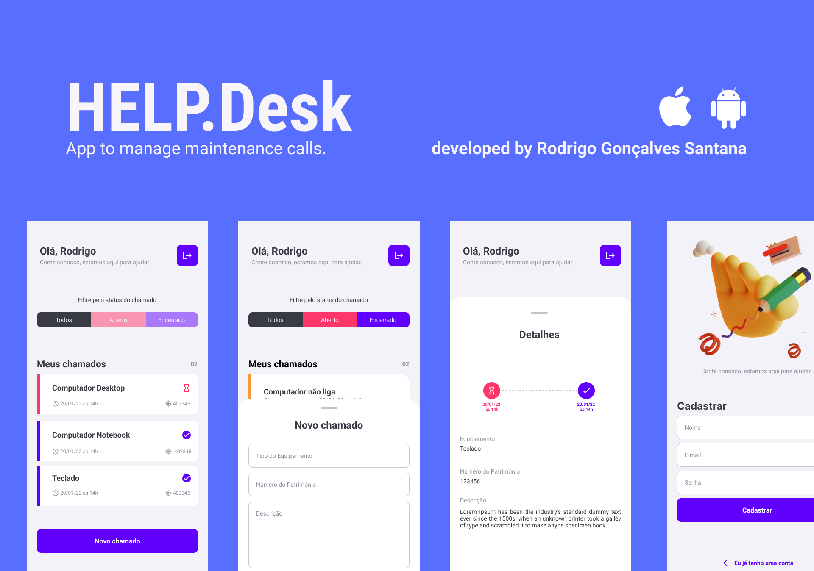

# HELP.Desk
App to manage maintenance calls. App to manage maintenance calls. This application was created for the purpose of studies.


## Stack

- React Native
- Typescript
- Expo Bare Workflow
- Firebase
- Firebase Auth
- Password recovery with e-mail
- Firebase Firestore with Real Time updates
- And more...


## Features

- User authentication 
- Create new user
- Create new order
- List orders
- Show real time status
- And more...


## Running

You have two branchs. The master you have project base with layout design only. And, the done you have the project finished with charts implemented.

Clone this project and start with Expo: 
```bash
  git clone branch_url
  cd expensesapp
  npm install
  expo start
```

## Feedback 

Would you like to speak with me? I find myself on Linkedin: [linkedin.com/in/rodrigo-goncalves-santana/](https://www.linkedin.com/in/rodrigo-goncalves-santana/)
 
[](https://www.linkedin.com/in/rodrigo-gon%C3%A7alves-santana/) 
</div>
